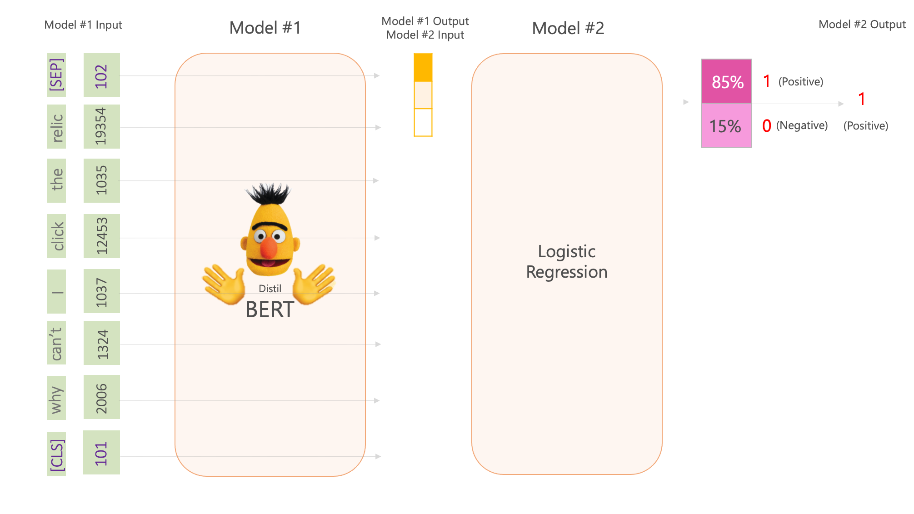

# Stream_Clippy_Capturing_Bugs_As_They_Happen

### Project Goal
The idea and goal of the Stream Clippy project is to creat a developer service that turns streamer videos into bugs. 

Whenever a team ships a new game or release an update, streamers would inevitably find some new bugs. The dev team will sometimes learn about these through either community team coverage or luck of the draw and seeing the stream in person. However, it is just not practical to watch them all with human eyes. We were thinking to create a service analyze the streamer's video and collect the bug videos that were encountered in the wild for dev team!

### Architecture

Here's how we do it:

1. Extra audio from the streamer video.
2. Run Speech-To-Text for the transcript.
3. Process the transcript through a BERT based classifier.
4. Generate short video clips around the identified timestamps.
5. Present the curated list to the team. Voila!

And this repo is mainly focus on the Bug classifier model part. (this is a three day hackathon event so the code in the jupyter notebook is not organized. But it's readable.)

We collected 39 streamers videos from Twitch and input to STT to get 508 examples with 69 bugs and 439 non-bugs. Through data augmentation, we augment the 69 bugs to 207 examples to handle the unbalanced datasets issue. With that, we feed these sentences to our binary classification model.

### Hacker's log
Our original hypothesis was that there's a direct correlation between the negative sentiments in a streamer's speech and the occurance of a bug in the game. We tested this hypothesis quickly with a sentiment analysis model (v1) and got back very promising results. We then trained our own BERT based logistic regression classifier (v2) with even better performance.

Recall = TP/ (TP + FN) (How many relevant items are selected?)
v1: 33.30%
v2: 100.00%

Precision = TP/ (TP + FP) (How many selected items are relevant?)
v1: 16.66%
v2: 21.43%

Compared to v1, v2's recall improved significantly. While the precision may seem low for general machine learning use cases, in our scenario, the cost of processing false positive sample of 20-second-clips is relatively low. On the other hand, the high recall is very important for us. Making sure we don't miss any bugs.

### Moving Forward
here are some items we will address.
1. Collect more data to address overfitting issue.
2. After that, consider to add additional features to help differentiate same words but different meaning, such as intonation and facial expression.

